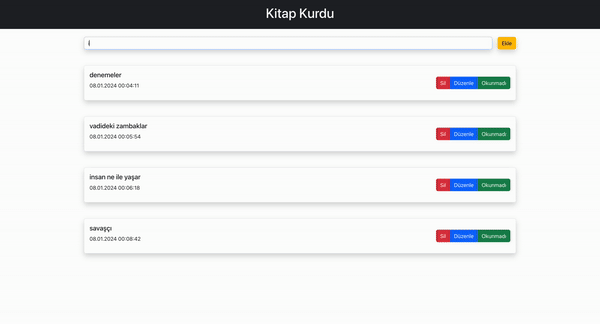

<h1>Kitap Kurdu</h1>
Bu React uygulaması, kitaplar üzerinde CRUD (Create, Read, Update, Delete) işlemlerini gerçekleştirmek için tasarlanmıştır. Bu uygulama, kullanıcıların kitap ekleyebilmesine, kitapları listeleyebilmesine, var olan kitapları düzenleyebilmesine ve silebilmesine olanak tanır.

<h2>Teknolojiler</h2>

- React: Kullanıcı arayüzü oluşturmak için.
- Bootstrap: Stillendirme için.
- react-toastify: Bildirim türleri için.
- uuid: Benzersiz id oluşturmak için.

# BookApp
